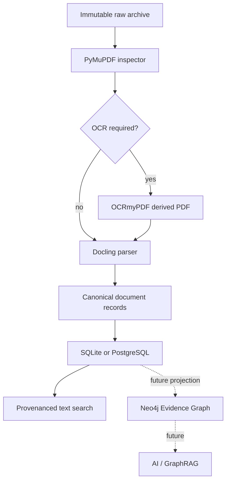

# Structured document analysis

The document-analysis layer turns an already archived, already provenanced
file into parser-neutral, page-aware records.  It does not collect documents,
create claims, promote evidence, call an AI service, or require Neo4j.



## Evidence and provenance

The raw archive is authoritative and immutable.  A document is registered
only with the provenance already captured at retrieval: source system, URL,
retrieval time, HTTP status, payload SHA-256, and raw-object path.  The
registration creates or updates a graph-ready `evidence_records` row; it does
not alter a module-specific evidence table.

An OCR PDF, parser JSON-equivalent structure, and extracted elements are
derived interpretations.  `derived_artifacts` preserves the input evidence
ID, output SHA-256, tool/version, and parameters.  The lineage is:

```text
document element -> document version -> derived artifact (when OCR is used)
-> evidence record -> immutable raw-object path + payload SHA-256
```

## Storage

By default derived files live under `data/derived/`, never `data/raw/`.
Set the complete `DERIVED_ARCHIVE_S3_*` group to store derived files in a
separate S3-compatible bucket.  PostgreSQL/SQLite store normalized metadata,
elements, tables, links, processing state, and quality—rather than binary
PDFs or repeated parser-native payloads.

## Parsers and OCR

Install local heavy tooling with:

```powershell
uv sync --extra documents
```

`PyMuPDF` supplies fast PDF inspection: page counts, text density, zero-text
pages, image counts, metadata, and encryption status.  Configurable,
deterministic text-density rules decide whether OCR is warranted.  OCRmyPDF
runs only when `DOCUMENT_OCR_ENABLED=true`; a failure is recorded as
retryable and does not invalidate the raw source.

`Docling` is the preferred parser.  `PyMuPDF` is a lightweight PDF fallback
when Docling is not installed.  Parser name, installed version, canonical
schema version, and configuration hash identify each non-destructive
`document_versions` record, so parser upgrades can be selectively rerun.
Docling and OCR are excluded from the Railway image: serving published state
does not need model downloads, Tesseract, or Ghostscript.

## Operations

Register a file only after its normal collection flow has supplied provenance:

```powershell
pipeline documents register --source-system committee_papers --payload-sha256 <sha> `
  --raw-object-path data/raw/committee_papers/<sha>.pdf --retrieved-at <ISO-8601> `
  --source-url <URL> --http-status 200
pipeline documents inspect data/raw/committee_papers/<sha>.pdf
pipeline documents process --source-system committee_papers --limit 25
pipeline documents status
pipeline documents search recruitment
pipeline documents validate
```

`reprocess` accepts a parser version, quality status, source system, or
document ID.  `benchmark` accepts a CSV with an `evidence_id` column and uses
a bounded default of 25 records.  Neither command enumerates or processes the
full archive without an explicit selection and limit.

For existing promoted documents, use the bounded registration bridge before
processing. It supports `committee_papers`, `cdp_documents`, and
`annual_reports`, and registers a row only when its legacy table has a direct
document URL, retrieval provenance, SHA-256, and a still-verifiable raw
archive object:

```powershell
pipeline documents register-existing --source committee_papers --limit 25
# Copy the value reported in source_systems, e.g. committee_paper_promotion.
pipeline documents process --source-system <reported-source-system> --parser pymupdf --limit 25
```

Both commands are resume-safe: registration excludes evidence already bridged
from that legacy table, and ordinary processing selects pending or failed
items before completed versions. Repeat this bounded pair until registration
reports `candidates: 0`; use `--force` or `reprocess` only for a deliberate
new parse run.

## Quality and limits

The quality status is an auditable heuristic, not a claim about source truth.
It records page coverage, characters, replacement-character ratio, duplicate
line ratio, heading/table counts, and empty-element ratio as `GOOD`,
`ACCEPTABLE`, `SUSPECT`, or `FAILED`.  Topic matches are deterministic finding
aids only; their presence is not evidence of a fact.

The bridge deliberately excludes candidate tables and legacy rows without
complete document provenance. It refuses to invent a source URL or retrieval
context. Its `source_systems` result gives the exact value to pass to
`documents process`; the supported sources currently use
the source-system labels are retained from the rows already in your database.
For a mixed PDF/HTML legacy batch, the processor automatically selects the
deterministic HTML fallback when PyMuPDF does not support the archived MIME
type. Integrating a collector should call
`DocumentService` after a successful archival write, while keeping parsing out
of the HTTP transaction.

The first rich-parser release targets PDFs, archived HTML, DOCX, and PPTX.
DOCX and PPTX use small standard-library ZIP/XML adapters in the lightweight worker;
structured machine-readable formats remain better served by the existing
archive extraction ledger and their native ingestion modules. Parser timeouts are configured
for worker orchestration; the synchronous CLI records a failed retryable run
if an adapter raises.
