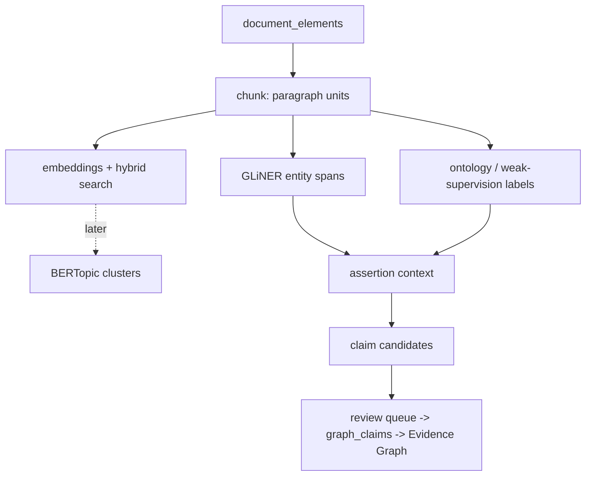

# Semantic analysis (`pipeline/nlp`)

A downstream, non-collecting stage over the document-analysis layer. It reads
`document_elements` (the parser-neutral output of `pipeline/documents`, see
[`document-analysis.md`](document-analysis.md)) and produces retrieval- and
analysis-ready records. It **fetches nothing, calls no paid AI service, and
requires no Neo4j**. Everything it writes is a *finding aid* or a *machine
candidate* — nothing is attributed to a provider or promoted to a claim
without a person, which is the existing review queue → `graph_claims` path
([`evidence-graph.md`](evidence-graph.md), migration `0050`).



## Why this exists

The warehouse holds tens of thousands of archived documents that sit as an
archive *attached to* structured tables, not as a queryable corpus. Keyword
search (`/api/v1/document_search`) cannot tell "no significant recruitment
difficulties" from "recruitment difficulties remain a significant risk", and
nothing connects a passage to the provider, place or issue it is about. This
layer closes that gap **without** changing what a defensible figure is: a
model span is a candidate a person confirms, an embedding says two passages
are similar (not that a fact is true), and a topic cluster is a reading of
wording (not a claim about the sector).

## Provenance model

Every invocation of a stage writes one `nlp_runs` row carrying the git
commit, the chunker/model/ontology versions and a hash of the full config.
Every derived row carries `nlp_run_id`. Model *names* are not identities —
`nlp_model_registry` records each model's provider, id and resolved
revision SHA. Reprocessing is expected: a chunk id is a hash of its own
content and the chunker version, so a chunker change produces new ids and
marks the old rows `superseded` rather than repointing an id at different
text. Nothing is deleted; a new generation is recomputed alongside the old.

The citation trail is by element id, not character offsets alone:

```
graph_claim -> claim candidate -> mention -> chunk
            -> element_start_id / element_end_id -> document_version
            -> evidence_record -> immutable raw-object path + payload SHA-256
```

## What ships now (tranche 034A)

**Chunks.** `document_chunks` — paragraph-level units merged from
`document_elements` to a token target, never split mid-element. A heading
flushes the current chunk and is remembered as its
`preceding_heading_element_id` (the hook for section-aware context later).
`char_start`/`char_end` are offsets into the version's concatenated element
text, for mapping a within-chunk span back to the whole document.

**Embeddings.** `pipeline/nlp/embeddings.py` writes one vector per (chunk,
model) into `document_embeddings`. Two embedders and no third path:

* `stub` — a signed hashed bag-of-words, deterministic across machines and
  Python builds (SHA-1 of the token, never salted `hash()`), no download.
  It is a stand-in, not a good retriever: it lets CI, the eval harness and
  offline development exercise embed → store → cosine → rank → fuse with no
  model on disk. Its registry row is provider `hash-stub` with a NULL
  `revision_sha`, so nothing can mistake it for a real model.
* a sentence-transformers id (default `all-MiniLM-L6-v2`), imported lazily,
  present only with the `nlp` extra, first-use download, Railway-excluded.
  Its resolved hub revision SHA is recorded on the run and the registry row.

The stage is resume-safe (`LEFT JOIN document_embeddings … IS NULL`): a
re-run fills gaps and recomputes nothing.

**Hybrid search.** `pipeline/nlp/semantic_search.py`, surfaced at
`/api/admin/search?mode=keyword|semantic|hybrid` (operator-only;
`/api/v1/*` is untouched) and `pipeline nlp search`. `keyword` is the
existing full-text index lifted from the matching *element* to its
containing *chunk*; `semantic` is exact Python-side cosine over
`document_embeddings`; `hybrid` (the default) fuses the two ranked lists by
Reciprocal Rank Fusion (k=60) and degrades to keyword-only when no
embeddings exist. Metadata filters (`source_system`, published-date range)
pre-filter the candidate set in every mode.

**Retrieval eval.** `pipeline/nlp/eval.py` + `pipeline nlp eval-retrieval`
score a mode against a human-marked query set
(`tests/fixtures/nlp/retrieval_queries.json` — JSON, because there is no
YAML dependency in the base install and the eval must run in the offline
suite): Recall@5/10, MRR, nDCG@5/10, averaged over the *marked* queries. A
marker is a verbatim on-topic passage (content-derived chunk ids are not
stable enough to hand-write into a fixture). This is the gate for changing
the embedding model later — no "BGE seems better" guesses. The committed
set is an 8-query seed with empty markers; growing it to 30–50 with real
markers is an operator task against the live warehouse.

```bash
uv run pipeline nlp chunk --source-system committee_paper_promotion --limit 25
uv run pipeline nlp embed --model stub          # offline; --dry-run to roll back
uv run pipeline nlp search --mode hybrid "services struggling to recruit enough workers"
uv run pipeline nlp eval-retrieval --mode hybrid
```

`nlp_runs` and `nlp_model_registry` carry the provenance. Migration `0065`
is structurally identical in both dialect trees — the embedding column is a
dialect-neutral little-endian float32 blob in each, so exact cosine is
computed in Python. A pgvector `vector` column and an ANN index are a later
Postgres-only migration, added **only** if the 034A retrieval benchmark
shows exact search is too slow, and gated on the server actually having the
`vector` extension.

## What ships now (tranche 034B) — the ontology

`pipeline/nlp/ontology/` is the SectorTrace controlled vocabulary, and
`pipeline/nlp/ontology.py` loads, validates and versions it. Three files:

* **`concepts.yml`** — each concept is a stable dotted id, one or more
  `categories`, and the surface `aliases` that mean it. Downstream tables
  store the id, never a label, so renaming a label or adding an alias never
  invalidates a stored annotation. `categories` may be plural; `pressure` is
  a *marker* category flagging a concept that names a difficulty, so the
  034E assertion layer can keep "no recruitment difficulties" apart from
  "recruitment difficulties remain".
* **`relations.yml`** — the closed predicate vocabulary every 034F claim
  candidate must use (`workforce.has_recruitment_pressure`,
  `finance.has_funding_reduction`, `commissioning.is_recommissioning`, …).
  Each carries its `subject` kind (provider / service / commissioner / area
  / workforce), its `object` shape (`none` / `concept:<category>` /
  `literal:<type>`) and a `pressure` flag. Nothing downstream may invent
  `has_issue` or `associated_with`.
* **`patterns/*.yml`** — regex weak-supervision seeds, consumed by 034C
  (labelling) and 034F (relation assembly), never here. The loader checks
  each pattern's `concept`/`predicate` reference resolves; it does not
  compile or run the regexes.

Matching is the m28 idiom: normalise (lowercase, punctuation → spaces,
corporate suffixes dropped), whole-token sliding window, with a shallow
`-s` plural fold so `workers`/`worker` share one alias. Ambiguous short
forms and bare acronyms are on the loader's `_UNSAFE_VARIANTS` list — a
concept still matches on its spelled-out aliases. `ontology.version()` is a
SHA-256 over the canonical content (independent of YAML formatting and
comments) and is what a consuming stage records as `ontology_version` on
its `nlp_run`.

YAML, not JSON, for a hand-maintained vocabulary (comments, no quoting or
commas). `pyyaml` is a base dependency — it must load with no `nlp` extra,
because 034C's classifier depends on it and is always-on.

## The tranches (BETA-034)

Ship and stop at each letter; later letters need not be correct for the
earlier ones to be useful.

| | Scope | State |
|---|---|---|
| **034A** | chunks + embeddings + hybrid search + retrieval eval harness | **shipped** — populating the 30–50-query gold set against the live warehouse is the remaining operator task |
| **034B** | SectorTrace ontology — stable concept ids, multi-category, controlled predicate vocabulary (`ontology/concepts.yml`, `relations.yml`, `patterns/`) | **shipped** — a starter vocabulary (~80 concepts, ~30 predicates); grown as 034C/F exercise it |
| **034C** | deterministic ontology classifier — replaces `classify.py` `TOPICS`' vocabulary; weak-supervision seed for 034G; `keyword_v1` rows never reinterpreted | planned |
| **034D** | GLiNER zero-shot **entity** spans (`PROVIDER`, `COMMISSIONER`, `SERVICE`, `SUBSTANCE`, `TREATMENT`, `ROLE`, `LOCATION`, `PROGRAMME`). Abstract situations are 034C's / 034G's job, not GLiNER labels. Entity resolution is a separate deterministic step — GLiNER never writes `entity_id` | planned |
| **034E** | assertion / context detection — `AFFIRMED` / `NEGATED` / `HISTORICAL` / `HYPOTHETICAL` / `CONDITIONAL` / `THIRD_PARTY` / `UNKNOWN`, with `assertion_status` and `detector_confidence` stored separately; medSpaCy `ConText` where installed, a stdlib cue tagger always | planned |
| **034F** | machine claim candidates (`document_claim_candidates`, high volume) via ontology relation patterns — **not** co-occurrence; a selection policy promotes a slice into `review_queue`; approval writes a `graph_claims` draft with the detector in `extractor_name`, never `promoted_by`; review decisions capture corrections, not just approve/reject | planned |
| **034G** | SetFit few-shot classifiers — **gated**: ≥ ~50 positive *and* ≥ ~50 negative decided examples per category, source/provider/time diversity, a held-out eval set, a minimum precision (precision favoured over recall) | gated |
| **034H** | active learning (review-queue ordering), then BERTopic (fenced: `/api/admin/*` finding aid only — not exported, not attributed, never counted or differenced across; `nlp_topic_model_runs` carries the full config, clusters are run-local), then RAG/LLM | gated / deferred |

## Deferred behind a decision

- **RAG / LLM question answering and free-form claim extraction.** Needs a
  named decision — "does this corpus ever make an LLM-derived claim?" — and
  is built against `pipeline/ai_promotion.py`'s policy gate (actor
  separation, ≥2 independent reviews, objective predicates, archived
  manifest). Answers must cite `graph_claims` / `evidence_records`
  provenance or they are not shown. No paid API before that decision.
- **Unsupervised topic discovery as evidence.** BERTopic clusters stay a
  navigation aid; a cluster is never an input to a figure, an export or a
  provider attribution.

## Dependencies

A local-only `nlp` optional-dependencies extra (`uv sync --extra nlp`),
first-use model download, **excluded from the Railway image** — the same
pattern as the `documents` and `ocr` extras. Every stage degrades honestly
without it: chunking needs nothing, `--model stub` gives a deterministic
embedder for CI and offline development, and the assertion detector falls
back to a stdlib cue tagger. CI never downloads a model.
