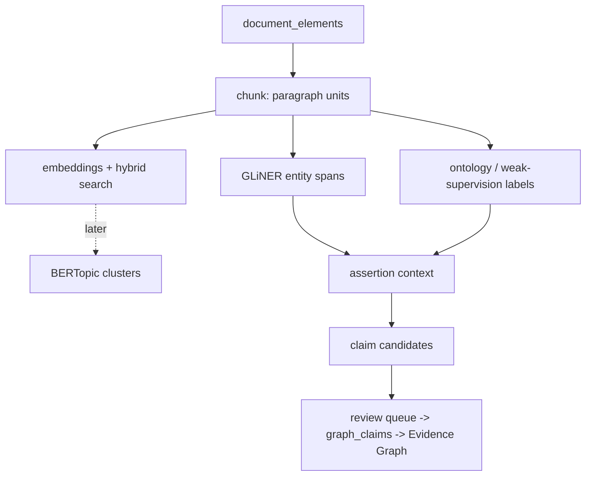

# Semantic analysis (`pipeline/nlp`)

A downstream, non-collecting stage over the document-analysis layer. It reads
`document_elements` (the parser-neutral output of `pipeline/documents`, see
[`document-analysis.md`](document-analysis.md)) and produces retrieval- and
analysis-ready records. It **fetches nothing, calls no paid AI service, and
requires no Neo4j**. Everything it writes is a *finding aid* or a *machine
candidate* — nothing is attributed to a provider or promoted to a claim
without a person, which is the existing review queue → `graph_claims` path
([`evidence-graph.md`](evidence-graph.md), migration `0050`).



## Why this exists

The warehouse holds tens of thousands of archived documents that sit as an
archive *attached to* structured tables, not as a queryable corpus. Keyword
search (`/api/v1/document_search`) cannot tell "no significant recruitment
difficulties" from "recruitment difficulties remain a significant risk", and
nothing connects a passage to the provider, place or issue it is about. This
layer closes that gap **without** changing what a defensible figure is: a
model span is a candidate a person confirms, an embedding says two passages
are similar (not that a fact is true), and a topic cluster is a reading of
wording (not a claim about the sector).

## Provenance model

Every invocation of a stage writes one `nlp_runs` row carrying the git
commit, the chunker/model/ontology versions and a hash of the full config.
Every derived row carries `nlp_run_id`. Model *names* are not identities —
`nlp_model_registry` records each model's provider, id and resolved
revision SHA. Reprocessing is expected: a chunk id is a hash of its own
content and the chunker version, so a chunker change produces new ids and
marks the old rows `superseded` rather than repointing an id at different
text. Nothing is deleted; a new generation is recomputed alongside the old.

The citation trail is by element id, not character offsets alone:

```
graph_claim -> claim candidate -> mention -> chunk
            -> element_start_id / element_end_id -> document_version
            -> evidence_record -> immutable raw-object path + payload SHA-256
```

## What ships now (tranche 034A)

**Chunks.** `document_chunks` — paragraph-level units merged from
`document_elements` to a token target, never split mid-element. A heading
flushes the current chunk and is remembered as its
`preceding_heading_element_id` (the hook for section-aware context later).
`char_start`/`char_end` are offsets into the version's concatenated element
text, for mapping a within-chunk span back to the whole document.

**Embeddings.** `pipeline/nlp/embeddings.py` writes one vector per (chunk,
model) into `document_embeddings`. Two embedders and no third path:

* `stub` — a signed hashed bag-of-words, deterministic across machines and
  Python builds (SHA-1 of the token, never salted `hash()`), no download.
  It is a stand-in, not a good retriever: it lets CI, the eval harness and
  offline development exercise embed → store → cosine → rank → fuse with no
  model on disk. Its registry row is provider `hash-stub` with a NULL
  `revision_sha`, so nothing can mistake it for a real model.
* a sentence-transformers id (default `all-MiniLM-L6-v2`), imported lazily,
  present only with the `nlp` extra, first-use download, Railway-excluded.
  Its resolved hub revision SHA is recorded on the run and the registry row.

The stage is resume-safe (`LEFT JOIN document_embeddings … IS NULL`): a
re-run fills gaps and recomputes nothing.

**Hybrid search.** `pipeline/nlp/semantic_search.py`, surfaced at
`/api/admin/search?mode=keyword|semantic|hybrid` (operator-only;
`/api/v1/*` is untouched) and `pipeline nlp search`. `keyword` is the
existing full-text index lifted from the matching *element* to its
containing *chunk*; `semantic` is exact Python-side cosine over
`document_embeddings`; `hybrid` (the default) fuses the two ranked lists by
Reciprocal Rank Fusion (k=60) and degrades to keyword-only when no
embeddings exist. Metadata filters (`source_system`, published-date range)
pre-filter the candidate set in every mode.

**Retrieval eval.** `pipeline/nlp/eval.py` + `pipeline nlp eval-retrieval`
score a mode against a human-marked query set
(`tests/fixtures/nlp/retrieval_queries.json` — JSON, because there is no
YAML dependency in the base install and the eval must run in the offline
suite): Recall@5/10, MRR, nDCG@5/10, averaged over the *marked* queries. A
marker is a verbatim on-topic passage (content-derived chunk ids are not
stable enough to hand-write into a fixture). This is the gate for changing
the embedding model later — no "BGE seems better" guesses. The committed
set is an 8-query seed with empty markers; growing it to 30–50 with real
markers is an operator task against the live warehouse.

```bash
uv run pipeline nlp chunk --source-system committee_paper_promotion --limit 25
uv run pipeline nlp embed --model stub          # offline; --dry-run to roll back
uv run pipeline nlp search --mode hybrid "services struggling to recruit enough workers"
uv run pipeline nlp eval-retrieval --mode hybrid
```

`nlp_runs` and `nlp_model_registry` carry the provenance. Migration `0065`
is structurally identical in both dialect trees — the embedding column is a
dialect-neutral little-endian float32 blob in each, so exact cosine is
computed in Python.

**The pgvector migration shipped (`0071`).** The gate was "only if exact
search is too slow", and on the live mirror it is: at **167,779** embeddings
one `--mode semantic` query took **~30 s** — `_semantic_ranked` pulls every
row for the model and scores each with a per-element Python loop, and it
grows linearly. `0071` adds `document_embeddings.embedding_vec`, a pgvector
`vector(384)` copy of the bytea, with an HNSW index; `_semantic_ranked` gets
a PostgreSQL-with-`vector` branch that orders by `<=>` against the index and
returns only `depth` rows. Everything else is unchanged: the bytea stays the
source of truth and the only thing SQLite (and a Postgres server without the
extension) holds, the exact Python path is the fallback, and
`embedding_vec` is filled from the bytea by
`pipeline nlp backfill-vectors` (run once automatically when `0071` first
applies). A model of a different width is a new migration — which is already
how a model change is handled, gated on the retrieval eval.

## What ships now (tranche 034B) — the ontology

`pipeline/nlp/ontology/` is the SectorTrace controlled vocabulary, and
`pipeline/nlp/ontology.py` loads, validates and versions it. Three files:

* **`concepts.yml`** — each concept is a stable dotted id, one or more
  `categories`, and the surface `aliases` that mean it. Downstream tables
  store the id, never a label, so renaming a label or adding an alias never
  invalidates a stored annotation. `categories` may be plural; `pressure` is
  a *marker* category flagging a concept that names a difficulty, so the
  034E assertion layer can keep "no recruitment difficulties" apart from
  "recruitment difficulties remain".
* **`relations.yml`** — the closed predicate vocabulary every 034F claim
  candidate must use (`workforce.has_recruitment_pressure`,
  `finance.has_funding_reduction`, `commissioning.is_recommissioning`, …).
  Each carries its `subject` kind (provider / service / commissioner / area
  / workforce), its `object` shape (`none` / `concept:<category>` /
  `literal:<type>`) and a `pressure` flag. Nothing downstream may invent
  `has_issue` or `associated_with`.
* **`patterns/*.yml`** — regex weak-supervision seeds, consumed by 034C
  (labelling) and 034F (relation assembly), never here. The loader checks
  each pattern's `concept`/`predicate` reference resolves; it does not
  compile or run the regexes.

Matching is the m28 idiom: normalise (lowercase, punctuation → spaces,
corporate suffixes dropped), whole-token sliding window, with a shallow
`-s` plural fold so `workers`/`worker` share one alias. Ambiguous short
forms and bare acronyms are on the loader's `_UNSAFE_VARIANTS` list — a
concept still matches on its spelled-out aliases. `ontology.version()` is a
SHA-256 over the canonical content (independent of YAML formatting and
comments) and is what a consuming stage records as `ontology_version` on
its `nlp_run`.

YAML, not JSON, for a hand-maintained vocabulary (comments, no quoting or
commas). `pyyaml` is a base dependency — it must load with no `nlp` extra,
because 034C's classifier depends on it and is always-on.

## What ships now (tranche 034C) — deterministic ontology labelling

`pipeline/nlp/label.py` + `pipeline nlp label`. For every non-superseded
chunk it runs the 034B matcher over each element the chunk covers and writes
provisional `document_topics` rows with `match_method='ontology_v1'`:

* one row per concept found — `topic = <concept_id>`, `match_count` = the
  number of distinct alias spans in that element;
* one `topic = 'cat:<category>'` rollup row per category present, summing its
  concepts' spans — the coarse "this element is about workforce" filter,
  mirroring what `keyword_v1` gives without needing the ontology loaded.

The stage records `ontology_version` on its `nlp_run`, and is idempotent: it
deletes and rewrites only its own `ontology_v1` rows for the elements in
scope. `keyword_v1` is left exactly as it was — its topics are UPPERCASE
buckets (`classify.TOPICS`, now documented as frozen), `ontology_v1` topics
are dotted ids or `cat:`-prefixed, so the two never collide on
`document_topics`' `(document_element_id, topic)` key. `classify.TOPICS` is
deliberately **not** wired to the ontology loader: a collection run must
need nothing from the nlp layer, so the "one vocabulary" guarantee is that
all *new* terms go in the ontology and the frozen list is never extended.

A tag marks wording, not fact: an `ontology_v1` row for
`workforce.recruitment_difficulty` fires on "no recruitment difficulties"
too. Affirmed / negated / historical is 034E's decision; until then a tag
finds passages, it does not count problems.

```bash
uv run pipeline nlp label --source-system committee_paper_promotion --limit 25
```

## What ships now (tranche 034D) — entity spans and resolution

`pipeline/nlp/spans.py` + `pipeline nlp spans` writes span-level
`document_concept_mentions` (migration `0066`): a labelled character range
inside a chunk, plus the element it falls in and the element-relative
offsets 034E/034F need. Label set, and only this: **PROVIDER, COMMISSIONER,
SERVICE, SUBSTANCE, TREATMENT, ROLE, LOCATION, PROGRAMME**. Abstract
situations are 034C's job and never a span label.

* **`stub`** — offline, deterministic, no download. Regex whole-word
  matching of the 034B ontology's SUBSTANCE / TREATMENT / ROLE / SERVICE /
  COMMISSIONER concepts, plus the maintained provider name variants
  (`keywords.SUPPLIER_NAME_VARIANTS`) as PROVIDER spans. `extraction_score`
  1.0, `concept_id` filled for the ontology-backed labels. It does **not**
  do LOCATION, PROGRAMME or novel provider names — only the model does.
* **`gliner`** — GLiNER zero-shot NER (CPU, no fine-tune), lazy import,
  `nlp` extra. `concept_id` always NULL; `extraction_score` is the model's
  own token→label score, named so it can't be read as P(true).

`extraction_score` is typed on purpose: 1.0 means "exact dictionary hit",
not "certainly correct". The table **never carries `entity_id`**.

`pipeline/nlp/resolve.py` + `pipeline nlp resolve` is the separate,
deterministic step: a PROVIDER span whose whole normalised text equals a
known provider variant, and whose Evidence-Graph entity
(`provider:<key>`, seeded by `pipeline graph backfill`) exists, gets a
`document_entity_mentions` row with `match_method='<extractor>+alias'`; a
COMMISSIONER span is matched against `LOCAL_AUTHORITY` entities by canonical
name. Anything weaker stays a bare concept mention — a lead, not an
attribution. There is no fuzzy matching and no model in this step.

The span-extraction eval (`pipeline/nlp/spans_eval.py`,
`pipeline nlp eval-spans`, `tests/fixtures/nlp/gold_spans.json`) reports
precision / recall / F1 per label against a human-annotated set — the gate
for a GLiNER model or threshold change. The committed set is a 4-entry seed;
growing it to ~100 from the live warehouse is an operator task.

```bash
uv run pipeline nlp spans   --source-system committee_paper_promotion --limit 25   # stub
uv run pipeline nlp resolve --source-system committee_paper_promotion
uv run pipeline nlp eval-spans
```

## What ships now (tranche 034E) — assertion / context detection

`pipeline/nlp/context.py` + `pipeline nlp context` writes one
`document_assertions` row (migration `0067`) per span: whether its sentence
**AFFIRMS** the concept, **NEGATES** it, places it in the past
(**HISTORICAL**), makes it **HYPOTHETICAL** or **CONDITIONAL**, or attributes
it to a **THIRD_PARTY**. `UNKNOWN` only when the span's sentence cannot be
located — never a default.

* **`cue`** — the always-on stdlib tagger. Regex cue families, each with a
  direction and a scope window; a cue modifies the target span if it is on
  the right side and no termination word (`but`, `however`, `;`, …) breaks
  the scope first. Precedence when several apply:
  NEGATED > HISTORICAL > HYPOTHETICAL > CONDITIONAL > THIRD_PARTY.
* **`medspacy`** — medSpaCy `ConText` where installed. **Not in the `nlp`
  extra**: spaCy pipeline models don't install as clean dependencies
  (`pip install medspacy` plus a spaCy model, then `--detector medspacy`).
  The cue tagger is the guaranteed path and the plan makes it always-on.

`assertion_status` and `detector_confidence` are separate columns: the rule
tagger can emit `NEGATED` at 0.7, and a low number does not mean "probably
AFFIRMED", it means the call is soft. `cue_start` / `cue_end` /
`sentence_sha256` pin exactly which words drove it.
`document_chunks.preceding_heading_element_id` (from `0065`) is already there
for section-aware context ("Risks" vs "Actions completed") later, no
migration needed.

The assertion eval (`pipeline/nlp/context_eval.py`,
`pipeline nlp eval-context`, `tests/fixtures/nlp/assertion_cases.json`)
reports accuracy per class and calls out the **hard negatives** separately —
"No staffing concerns were identified", "Recruitment difficulties had
resolved", "Other authorities experienced vacancy pressure", … — the
sentences the whole tranche exists to get right.

```bash
uv run pipeline nlp context --source-system committee_paper_promotion --limit 25
uv run pipeline nlp eval-context
```

## What ships now (tranche 034F, first cut) — machine claim candidates

`pipeline/nlp/relations.py` + `pipeline nlp relations` assembles
(subject, predicate, object) triples from 034D spans and 034E assertion
status into `document_claim_candidates` (migration `0068`, high-volume by
design). **Two triggers, and only these:** a controlled concept→predicate
mapping (`CONCEPT_PREDICATE`, fired only when that concept's phrase is
actually in the sentence) or a predicate pattern from
`ontology/patterns/*.yml`. Two spans sharing a sentence is not a claim.

The subject must be a span of the kind the predicate's `subject` allows
(`workforce.*` claims take the **organisation**, not the ROLE span), with
documented fallbacks and — for `service` / `workforce` predicates — an
explicit anaphor ("the service", "staff") recorded in `subject_hint`. The
assertion is taken at the **trigger**, not the subject: "CGL reports no
recruitment difficulties" negates the difficulties. `relation_score` ranks
candidates for a reviewer; it is never multiplied into a figure.

`pipeline/nlp/promote.py` + `pipeline nlp queue-claims` is the narrow policy
between the high-volume table and `review_queue`: a **primary** slice
(campaign predicate, score floor, `AFFIRMED`, subject resolves to a
registered entity), a **contradiction** slice (same subject+predicate
asserted both ways across documents), a **novel** slice (a
(subject, predicate) pair the Evidence Graph has never held), and a small
deterministic **validation** sample. It writes `review_queue` items
(`item_type='semantic_claim_candidate'`) with the sentence, chunk id,
offsets, source URL and payload SHA-256 in `context_json`, and marks the
candidate `queued`.

`pipeline/nlp/decisions.py` + `pipeline nlp decide-claim` records a person's
verdict on a candidate into `claim_candidate_decisions`: `approved` /
`rejected` / `corrected`, and when `corrected`, a better predicate, object or
subject plus a `reason_code`. A corrected candidate is far stronger training
data than a binary reject — `decisions.training_export()` is the shape 034G
reads. The reviewer's name is recorded as given, never defaulted. The
candidate moves to `accepted` (approved / corrected) or `dismissed`
(rejected); `accepted` does **not** mean a graph draft exists.

**Held:** the approved-candidate → `graph_claims` draft write. `graph_claims`
has no writer anywhere in the codebase (a dormant schema from migration
`0050` with a provenance reader and a Neo4j projector, no draft →
`entity_relationships` lifecycle), so being its first writer is a separate
decision — not part of this tranche. When it lands it must set the detector
in `extractor_name` / `extractor_version`, leave `confidence` for the
reviewer, `review_status='draft'`, and never touch `promoted_by`
(`pipeline/ai_promotion.py`). Nothing is auto-promoted (decision 4).

```bash
uv run pipeline nlp relations    --source-system committee_paper_promotion --limit 25
uv run pipeline nlp queue-claims --source-system committee_paper_promotion
uv run pipeline nlp decide-claim --candidate cc-… --decision corrected \
    --by "A. Reviewer" --corrected-predicate workforce.has_retention_pressure
```

## Getting from 034F to 034G

034G (SetFit) is gated, and the gate is measurable. `pipeline nlp gate-034g`
(`pipeline/nlp/gate.py`) reads `claim_candidate_decisions` and reports, per
classifier category (`vacancy_pressure`, `agency_reliance`, `tupe_transfer`,
`funding_reduction`, `cost_pressure`, `waiting_time` — redrawn after the first
full cycle around the predicates the corpus actually produced in volume; see
the comment on `GATE_CATEGORIES`): decided positive / negative counts,
source-system / distinct-subject / year spread, inter-reviewer agreement on
double-reviewed items, and a `blocking` list of exactly what is short. It
exits non-zero until every condition holds. A *positive* is an `approved`
+ `AFFIRMED` candidate for that predicate, or one `corrected` to it; a
*negative* is a `rejected` one, a `corrected`-away one, or an `approved` but
`NEGATED` / `HISTORICAL` / `THIRD_PARTY` one.

```bash
uv run pipeline nlp gate-034g          # exits 1 with a blocking list until ready
```

The path to a green gate is reviewer labour, not code: run the chain on the
real warehouse with a real embedder, work the `semantic_claim_candidate`
queue with `decide-claim` (favouring `corrected` over bare `reject`), and
re-check the gate.

## The tranches (BETA-034)

Ship and stop at each letter; later letters need not be correct for the
earlier ones to be useful.

| | Scope | State |
|---|---|---|
| **034A** | chunks + embeddings + hybrid search + retrieval eval harness | **shipped** — populating the 30–50-query gold set against the live warehouse is the remaining operator task |
| **034B** | SectorTrace ontology — stable concept ids, multi-category, controlled predicate vocabulary (`ontology/concepts.yml`, `relations.yml`, `patterns/`) | **shipped** — a starter vocabulary (~80 concepts, ~30 predicates); grown as 034C/F exercise it |
| **034C** | deterministic ontology classifier — `document_topics` `ontology_v1` rows over chunked elements; `classify.py` `TOPICS` frozen and documented, not code-coupled; weak-supervision seed for 034G; `keyword_v1` untouched | **shipped** |
| **034D** | GLiNER zero-shot **entity** spans (`PROVIDER`, `COMMISSIONER`, `SERVICE`, `SUBSTANCE`, `TREATMENT`, `ROLE`, `LOCATION`, `PROGRAMME`) into `document_concept_mentions` (migration `0066`); offline dictionary stub for CI; `resolve.py` a separate deterministic step; neither writes `entity_id` | **shipped** — grow `gold_spans.json` and swap the stub for GLiNER against it |
| **034E** | assertion / context detection into `document_assertions` (migration `0067`) — `AFFIRMED` / `NEGATED` / `HISTORICAL` / `HYPOTHETICAL` / `CONDITIONAL` / `THIRD_PARTY` / `UNKNOWN`; `assertion_status` and `detector_confidence` separate; stdlib cue tagger always on, medSpaCy `ConText` an optional path (not in the extra) | **shipped** — grow `assertion_cases.json`; wire medSpaCy if its model install is worth it |
| **034F** | machine claim candidates (`document_claim_candidates`, migration `0068`) via controlled concept→predicate + pattern triggers — **not** co-occurrence; `promote.py` queues a slice into `review_queue`; `decisions.py` records approve / reject / **correct** into `claim_candidate_decisions` (034G's training signal) | **shipped bar the graph write** — being `graph_claims`' first writer is held as its own decision |
| **034G** | SetFit few-shot classifiers — **gated**: ≥ ~50 positive *and* ≥ ~50 negative decided examples per category, source/provider/time diversity, a held-out eval set, a minimum precision (precision favoured over recall) | **gated** — `pipeline nlp gate-034g` reports readiness; closing it is reviewer labour |
| **034H** | active learning (review-queue ordering), then BERTopic (fenced: `/api/admin/*` finding aid only — not exported, not attributed, never counted or differenced across; `nlp_topic_model_runs` carries the full config, clusters are run-local), then RAG/LLM | gated / deferred |

## Deferred behind a decision

- **RAG / LLM question answering and free-form claim extraction.** Needs a
  named decision — "does this corpus ever make an LLM-derived claim?" — and
  is built against `pipeline/ai_promotion.py`'s policy gate (actor
  separation, ≥2 independent reviews, objective predicates, archived
  manifest). Answers must cite `graph_claims` / `evidence_records`
  provenance or they are not shown. No paid API before that decision.
- **Unsupervised topic discovery as evidence.** BERTopic clusters stay a
  navigation aid; a cluster is never an input to a figure, an export or a
  provider attribution.

## Dependencies

A local-only `nlp` optional-dependencies extra (`uv sync --extra nlp`),
first-use model download, **excluded from the Railway image** — the same
pattern as the `documents` and `ocr` extras. Every stage degrades honestly
without it: chunking needs nothing, `--model stub` gives a deterministic
embedder for CI and offline development, and the assertion detector falls
back to a stdlib cue tagger. CI never downloads a model.
